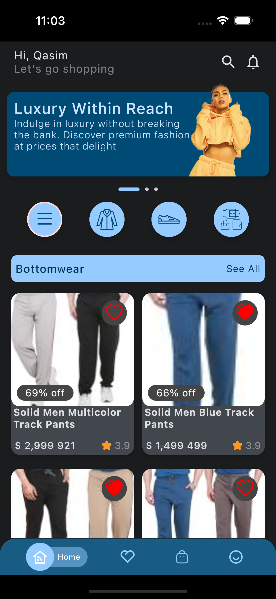
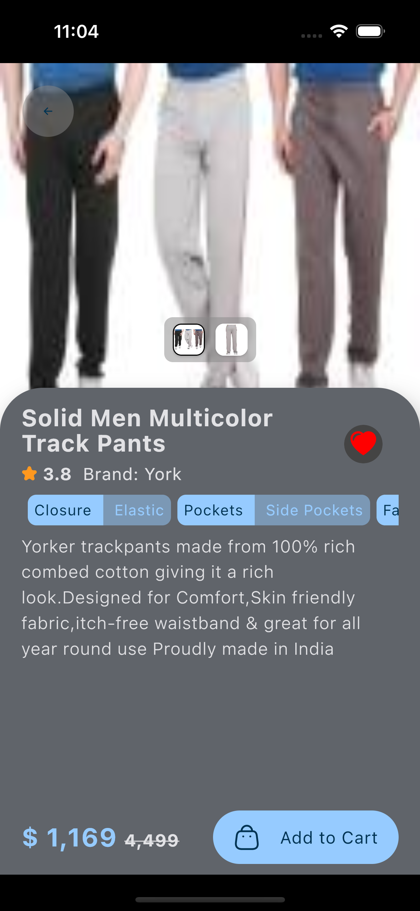
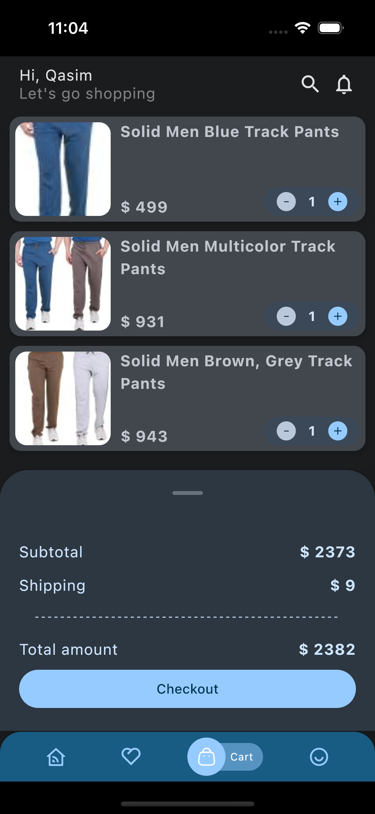

# CartWave eCommerce Mobile App

Welcome to CartWave, an open-source eCommerce mobile app designed to enhance and showcase my experience with Kotlin Multiplatform (KMP). This project serves as a hands-on exploration of cross-platform development, leveraging the power of KMP to create a versatile eCommerce solution.

## Libraries Used

🌐 [**Kotlin Multiplatform Mastery:**](https://kotlinlang.org/docs/multiplatform.html) Dive into the world of Kotlin Multiplatform, witnessing its prowess in building a unified codebase for both iOS and Android platforms.

🚀 [**Decompose for Lifecycle Management and Routing:**](https://github.com/arkivanov/Decompose) Employ Decompose for efficient lifecycle management and screen routing, ensuring a clean and scalable architecture.

🔄 [**Multiplatform Settings:**](https://github.com/russhwolf/multiplatform-settings) Utilize Multiplatform Settings for the hassle-free storage of simple key-value data, ensuring a smooth user experience across platforms.

🔄 [**Koin for Dependency Management:**](https://insert-koin.io/) Leverage Koin for simple and powerful dependency injection, fostering modular and maintainable code.

🚀 [**ktor for Network Calls:**](https://ktor.io/) Utilize ktor for making efficient network calls, enabling smooth communication with backend services.

🖼️ [**Coil for Image Loading:**](https://github.com/coil-kt/coil) Employ Coil for efficient and flexible image loading, enhancing the visual appeal of the app.

🔄 [**Multiplatform Paging:**](https://github.com/cashapp/multiplatform-paging) Benefit from the multiplatform-paging library, which packages AndroidX Paging for Kotlin/Multiplatform, allowing seamless and efficient data paging.

## Screenshots
  

## Video

## Backend

The backend for CartWave is developed separately and hosted in another repository. To set up and run the backend services, please refer to the [CartWave-Backend-Ktor](https://github.com/QasimNawaz/CartWave-Backend-Ktor).

Thank you for exploring CartWave. Let's continue pushing the boundaries of Kotlin Multiplatform together! 🛒🌊

## Connect with Me

🐦 **Twitter:** [Qasim Nawaz](https://twitter.com/qasimnawaz019)

🔗 **LinkedIn:** [Qasim Nawaz](https://www.linkedin.com/in/qasimnawaz019/)

🐦 **Medium:** [Qasim Nawaz](https://medium.com/@qasimnawaz_70901)